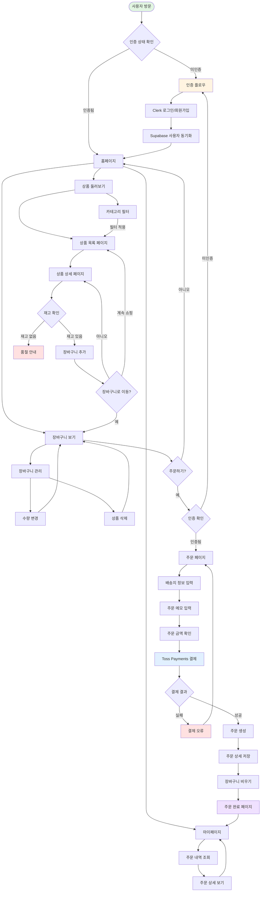
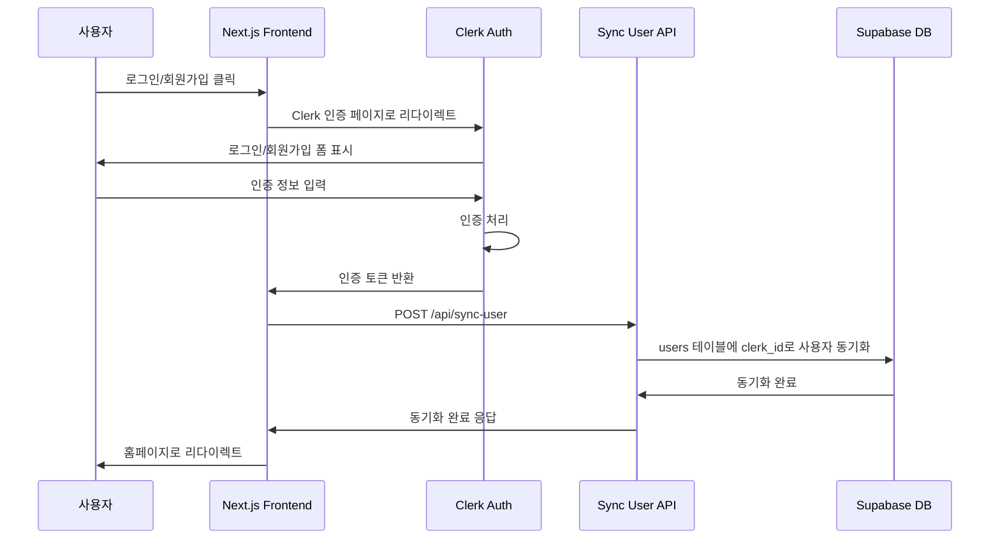
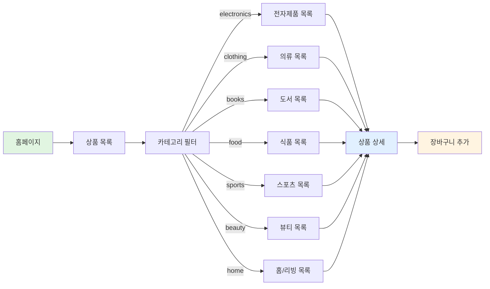
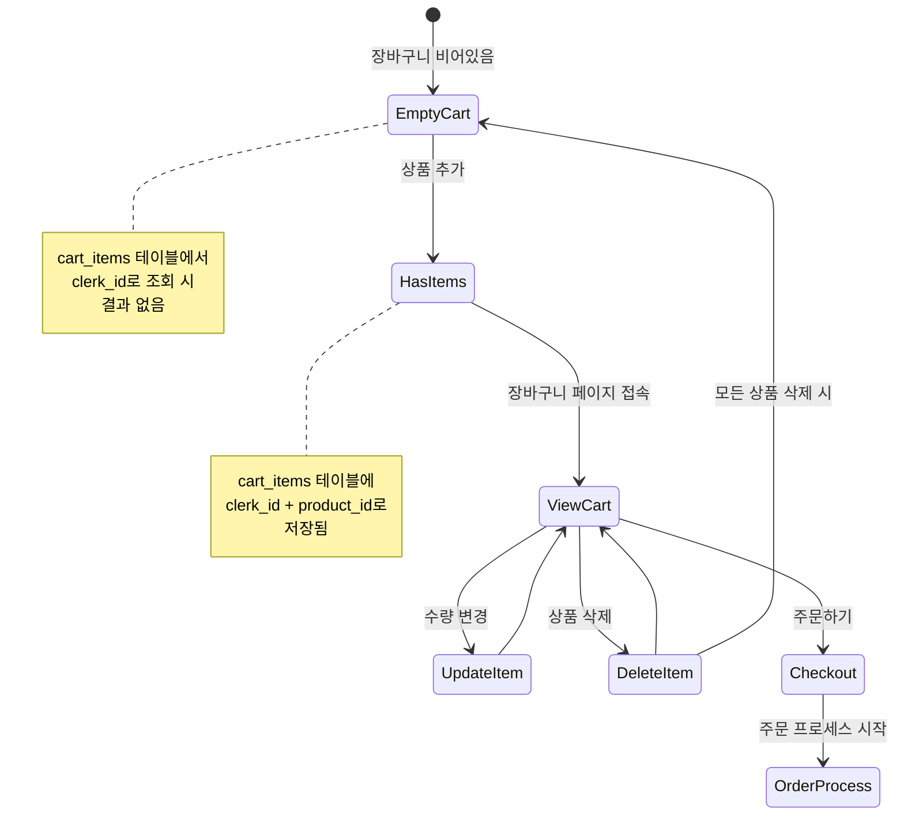
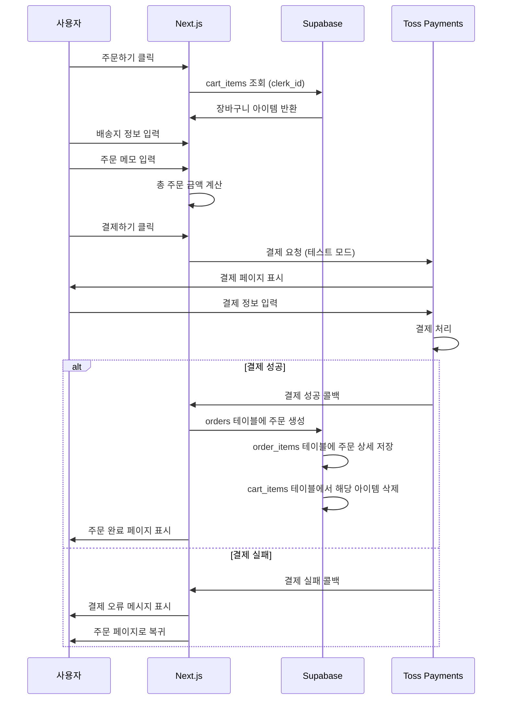
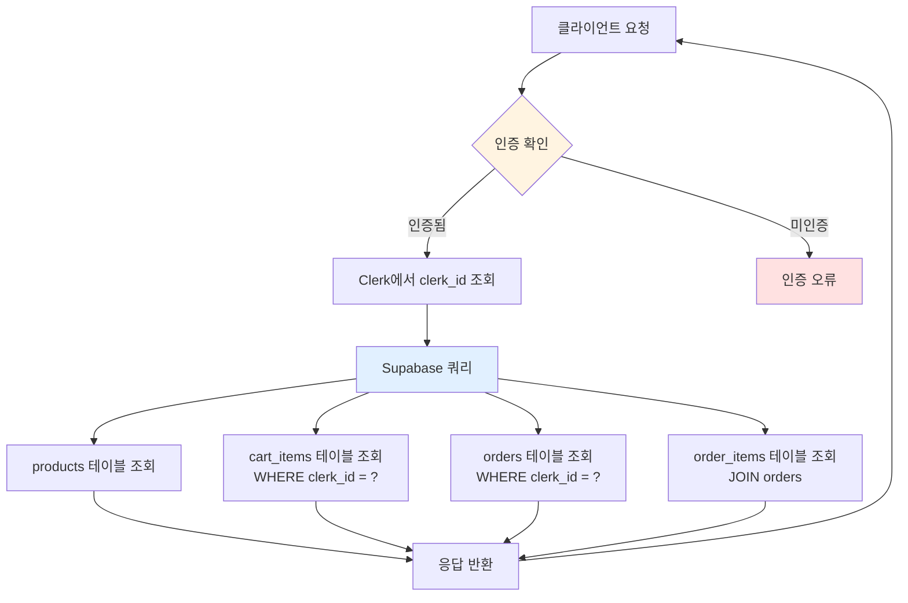
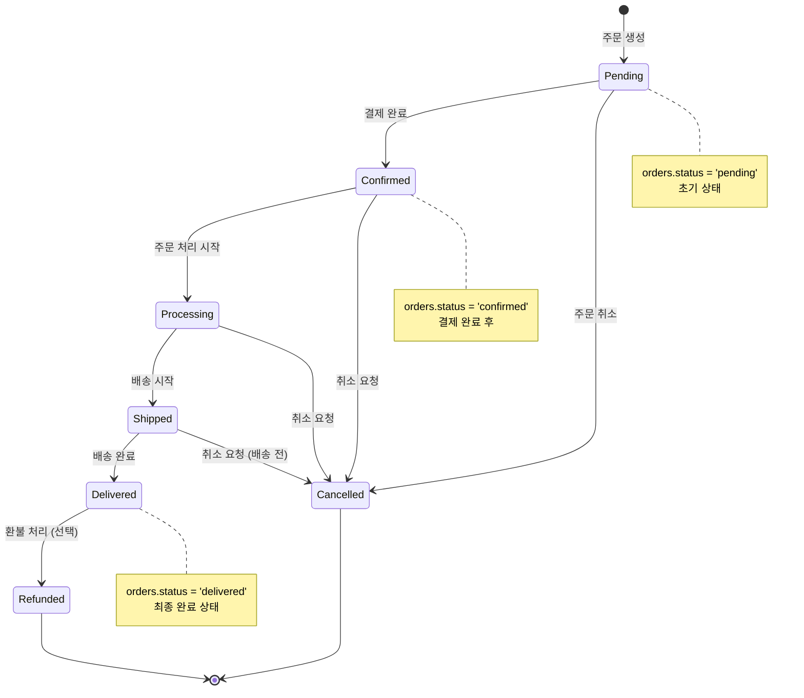
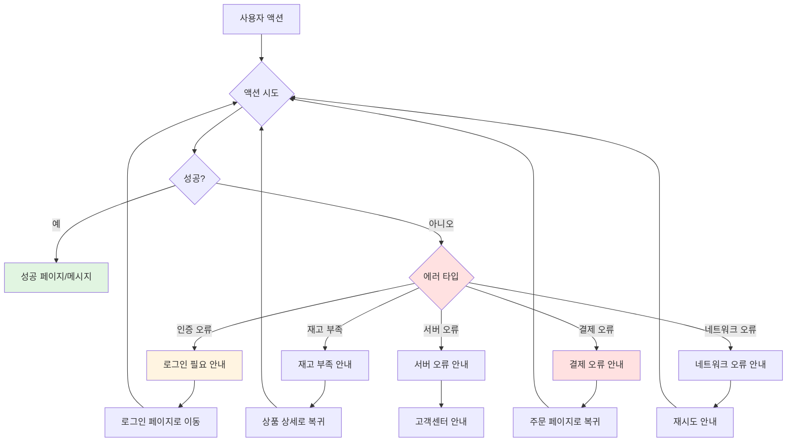

# 쇼핑몰 MVP 유저 플로우

쇼핑몰의 주요 사용자 시나리오를 Mermaid 플로우차트로 시각화합니다.

## 전체 유저 플로우 (메인 플로우)



## 인증 플로우 상세



## 상품 조회 플로우



## 장바구니 플로우



## 주문 및 결제 플로우



## 데이터베이스 연동 플로우



## 주문 상태 플로우



## 에러 처리 플로우



## 주요 페이지 네비게이션

```mermaid
graph LR
    Home[/ 홈페이지<br/>/] --> Products[/ 상품 목록<br/>/products]
    Home --> Cart[/ 장바구니<br/>/cart]
    Home --> MyPage[/ 마이페이지<br/>/my-page]
    
    Products --> Detail[/ 상품 상세<br/>/products/[id]]
    Products --> Category[/ 상품 목록<br/>카테고리 필터<br/>/products?category=electronics]
    
    Detail --> Cart
    Detail --> Products
    
    Cart --> Checkout[/ 주문하기<br/>/checkout]
    Cart --> Products
    
    Checkout --> Complete[/ 주문 완료<br/>/order/complete]
    
    MyPage --> OrderHistory[/ 주문 내역<br/>/my-page/orders]
    MyPage --> OrderDetail[/ 주문 상세<br/>/my-page/orders/[id]]
    
    OrderDetail --> OrderHistory
    OrderHistory --> MyPage
    
    Complete --> MyPage
    Complete --> Products
    
    style Home fill:#e1f5e1
    style Complete fill:#f0e1ff
    style Checkout fill:#e1f0ff
```

